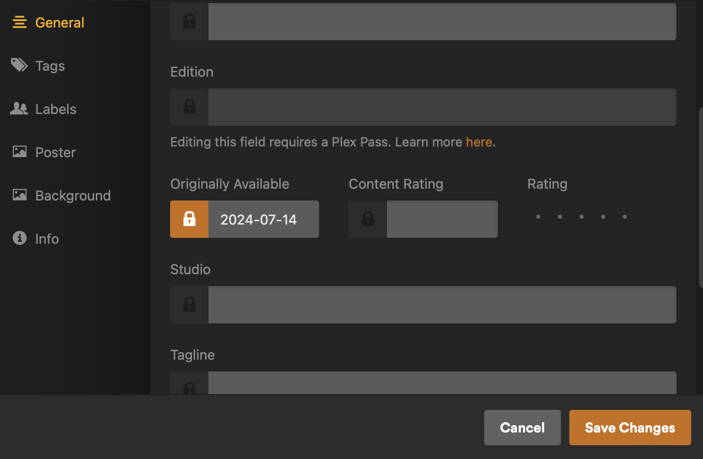

# Plex Scripts


## update_release_date.sh
Script iterates recursively from parent directory (passed as argument) and defaults ContentCreateDate to 1969-12-31 if field does not already exist with a meaningful value.   
Script can easily be modfied for other metadata


### Requirements
- [exiftool](https://exiftool.org/install.html)

### Scenario
In Plex, you may have multiple assets with locked metadata fields  
  
However, updating the underlying file's metadata and refreshing metadata in Plex will not overwrite these locked fields.  
In my experience, release date for home videos routinely gets mangled by Plex. Updating video metadata fixes this issue.  

### Instructions
#### Bulk Unlock Plex Assets' attributes
Rather than manually selecting all of your plex assets to update attributes with variable success, this method lets you leverage Plex API.  
Acquire your token and library key by following these [directions](https://support.plex.tv/articles/204059436-finding-an-authentication-token-x-plex-token/), [see also](old.reddit.com/r/PleX/comments/mwzbh5/is_there_any_easy_way_to_unlock_tags_on_metadata/)  

In your internet browser, navigate to your plex library. Open your browser's console, and run this call with your appropriate fields. 
```
fetch('http://127.0.0.1:32400/library/sections/YOUR_LIBRARY_KEY_HERE/all?type=1&originallyAvailableAt.locked=0&X-Plex-Token=YOUR_TOKEN_HERE', { method : "PUT" })
```

In this example, we're unlocking OriginallyAvailableAt field by setting it to 0 for all assets.    
You can explore other fields by viewing XML tags on an asset.  

#### Running the Script from Command Line
```
chmod +x ./update_release_date.sh
./update_release_date.sh /Volumes/External_Media/media_library/home_videos
```
